# Readerware to Tellico Conversion Tool

[](https://github.com/DryHumour/readerware-to-tellico/actions/workflows/ci.yml)
[](https://github.com/DryHumour/readerware-to-tellico/actions/workflows/release.yml)

A utility to convert CSV exports from Readerware collections into Tellico collections.  Field normalisation and auditing is performed.  Developed as a "Digital Conservation" effort to move collection data with minimal data loss.

## Exporting Readerware Data

Before you can run the conversion tool, you must export your collection data from Readerware into CSV format.

### Step-by-Step Guide

1. **Open Readerware** and load the collection you wish to migrate (Books, Music, or Video).
2. **Select Export**: Navigate to the `File>Export...` menu option.
   
   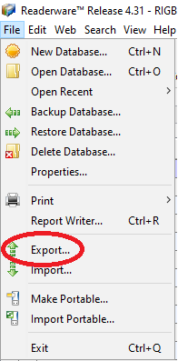
   
3. **Configure CSV Format**: For `Format`, choose `CSV (Comma Separated Value)`.  Both `Output header line` and `Enclose fields in double quotes` *must* be checked; `Escape new lines` *must* be unchecked.  Press "Next".
   
   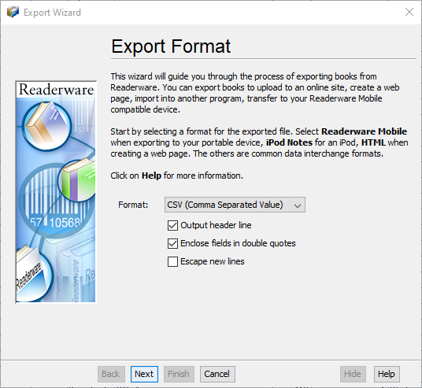
   
4. **Select Output File**: Choose the `File Name` of the output file. `Encoding` *must* be `UTF-8`. Press "Next".
   
   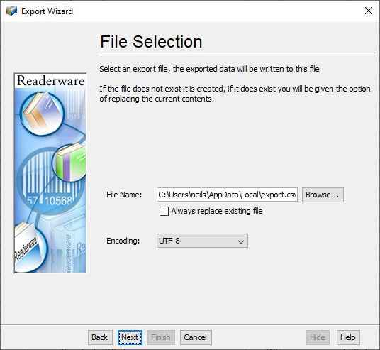
   
5. **Select Items to Export**: Choose the items to be exported. "All in the database" is usually the best choice. Press "Next".
   
   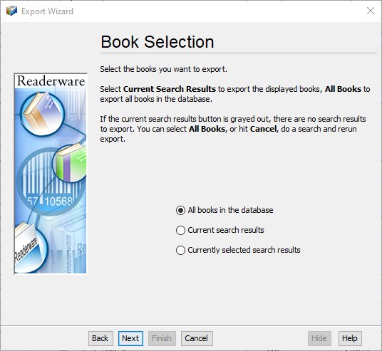
   
6. **Select Columns to Export**: Choose which database columns (fields) to export. This should usually be `Selected Database Columns` with all columns selected. `UPPERCASE Title` and `Export Image URLs` should not be selected. Press "Next".
   
   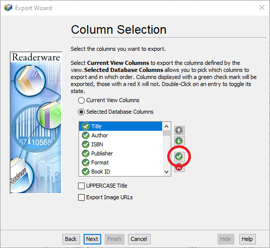
   
7. **Verify your choices**: Verify your choices and press "Next".
   
   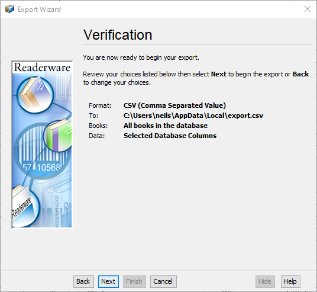
   
8. **Exporting**: The export process will complete and save the file.  Press "Next".
   
   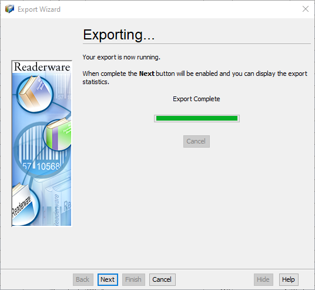
   
9. **Done**: Review the export statistics.  No errors are expected.  Press "Finish".
   
   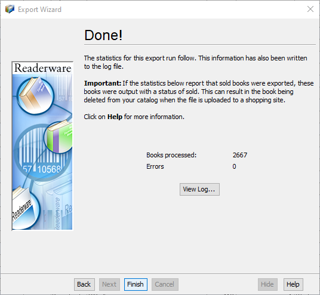

### Exporting Readerware Images

Readerware has a somewhat idiosyncratic way of handling images. It stores images in its database in two groups of four: up to four normal (thumbnail) images; and up to four large images.

Readerware does support exporting images via its File Export mechanism.  Unfortunately it requires the export to be run separately for each of the eight possible images.  This is rather tedious and can be error prone if one accidentally forgets to place each export in its own directory.  As an alternative, this tool can automatically extract images from the Readerware database directly.

**NOTE:** Because the storage requirements for images can be very large, it is strongly recommended *not* to choose output directories that are backed up to a cloud service e.g. OneDrive, Google Drive, etc.  Note that on Windows it is often the case that a user's Documents, Desktop, Pictures, etc. folders are backed up using OneDrive.

#### Automatically Extracting Images

Instead of exporting each image category manually, you can use the built-in `images extract` command to pull all image blobs directly from the Readerware database.

```bash
readerware-to-tellico images extract /path/to/readerware/database /path/to/extracted_images
```

Once extracted, you can supply this single folder to any of the conversion commands using the `--extracted-images-dir` option:

```bash
readerware-to-tellico books --extracted-images-dir /path/to/extracted_images
```

#### Manually Exporting Images

If you prefer to use the native Readerware export feature, you must perform up to eight separate exports (four for standard images, and four for large/high-resolution images). 

Ensure you save each category into a **separate, dedicated directory**. For example:

* Standard Images: `rw_images1`, `rw_images2`, `rw_images3`, `rw_images4`
* Large/High-Resolution Images: `rw_large1`, `rw_large2`, `rw_large3`, `rw_large4`

When running the conversion, reference these directories using their matching CLI flags:

```bash
readerware-to-tellico books \
  --first-images-dir /path/to/rw_images1 \
  --second-images-dir /path/to/rw_images2 \
  --third-images-dir /path/to/rw_images3 \
  --fourth-images-dir /path/to/rw_images4 \
  --first-large-images-dir /path/to/rw_large1 \
  --second-large-images-dir /path/to/rw_large2 \
  --third-large-images-dir /path/to/rw_large3 \
  --fourth-large-images-dir /path/to/rw_large4
```

##### Step-by-step

1. **Open Readerware** and load the collection you wish to migrate (Books, Music, or Video).
2. **Select Export**: Navigate to the `File>Export...` menu option.
   
   
   
3. **Configure Images Format**: For `Format`, choose `Images` and press "Next".
   
   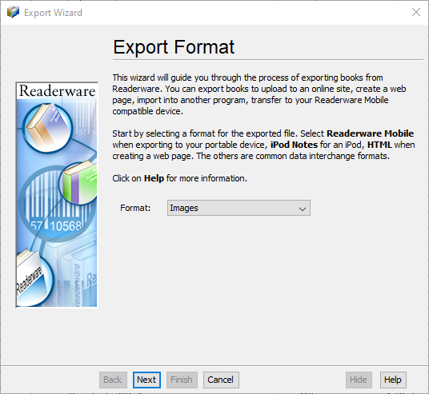
   
4. **Select Output Folder**: Choose the `Folder Name` of the output folder.  Ensure that each export goes to a *separate* folder.  Press "Next".
   
   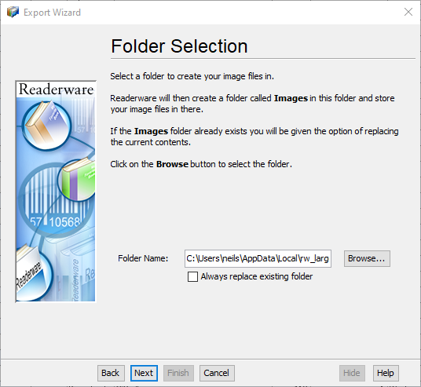
   
5. **Select Items to Export**: Choose the items to be exported. "All in the database" is usually the best choice.  Press "Next".
   
   
   
6. **Select Image to Export**: Choose which of the eight `Image` columns to export this time.  The `Image Format` should usually be `JPG`.  The `Image Name` *must* be `Book ID`.  Press "Next".
   
   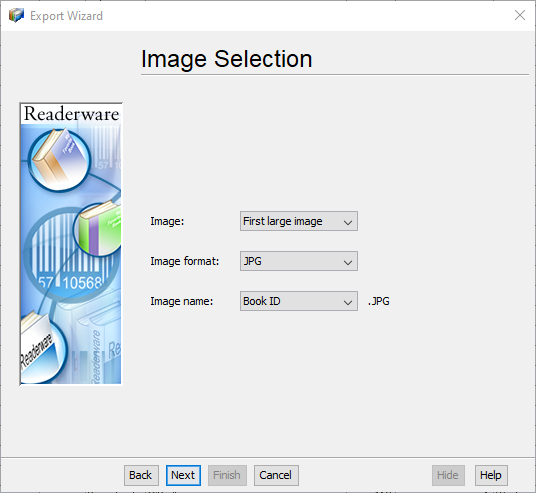
   
7. **Verify your choices**: Verify your choices and press "Next".
   
   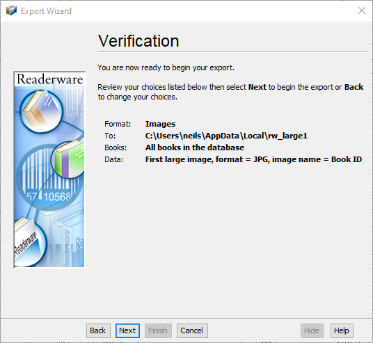
   
8. **Exporting**: The export process will complete and save the file. Press "Next".
   
   
   
9. **Done**: Review the export statistics.  Any item which has no image of the selected category will be reported as an error: this is expected and is harmless.  Press "Finish".
   
   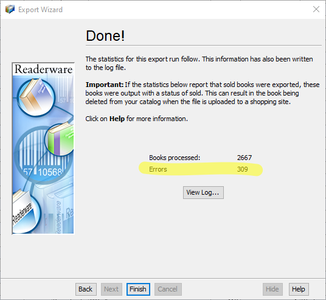

10. **Repeat**: Perform steps 2-9 for each of the eight image categories, being certain to use a different output folder each time.

## Conversion

The tool provides three primary commands for converting different collection types: `books`, `music`, and `video`. Because all three commands share the same underlying migration engine, they operate under a unified set of options and workflows.

### Basic Conversion

To perform a default conversion, export your Readerware collection as a CSV file, and run the corresponding command. By default, each command expects an input file named `export.csv` in your current directory and produces an appropriate Tellico package:

```bash
# Convert Books (generates books.tc)
readerware-to-tellico books

# Convert Music (generates music.tc)
readerware-to-tellico music

# Convert Video (generates video.tc)
readerware-to-tellico video
```

### Key Options

You can override the default input and output file paths using the `-i` (or `--input-file`) and `-o` (or `--output-file`) flags:

```bash
readerware-to-tellico books -i my_library.csv -o my_library.tc
```

### Image Handling

Readerware collections often have associated cover art and secondary images. Tellico packages these images directly inside the output compressed `.tc` file. The tool supports multiple ways to locate and embed these images:

#### 1. Readerware Image Exports
If you exported your images from Readerware, you can supply those directories directly. The tool supports both standard and large image folders, up to four directories each:

```bash
readerware-to-tellico books \
  --first-images-dir /path/to/images_1 \
  --first-large-images-dir /path/to/large_images_1
```

#### 2. Extracted Database Images
If you extracted your images directly from the Readerware database using the `images extract` sub-command, point the tool to the output extraction directory:

```bash
readerware-to-tellico books --extracted-images-dir /path/to/extracted_images
```

#### Concurrency
Image copying is fully parallelized. By default, it uses 16 concurrent workers, which you can adjust via the `--concurrency` flag:

```bash
readerware-to-tellico books --concurrency 8
```

### Custom Templates

For advanced users, the formatting and mapping pipeline can be customized. You can provide directories containing custom Go HTML/text templates using the `--template-dirs` flag:

```bash
readerware-to-tellico books --template-dirs /path/to/custom/templates
```

For a detailed guide on creating, overriding, and customizing templates, see the [Template Customization Guide](docs/TEMPLATES.md).

### Audit Feature

The conversion tool automatically flags entries that may require human review during the conversion process. The generated Tellico database includes three audit-related features to help you identify and address these items:

- **Requires Audit Checkbox**: A boolean field on each entry that indicates whether the item has been flagged for manual review. This is automatically set to `true` when the tool detects potential data issues (*e.g.*, suspicious name patterns, missing critical fields, or ambiguous values, *et al.*).

- **Audit Reasons Field**: A text field that explains why an entry was flagged. This provides context about what specific issues triggered the audit flag, helping you understand what needs attention.

- **Requires Audit Filter**: A pre-configured filter in Tellico that lets you quickly view only the items that require audit. This allows you to efficiently work through the flagged entries without manually searching through your entire collection.

After importing the `.tc` file into Tellico, you can use the "Requires Audit" filter to display only the flagged entries, review the audit reasons for each, make any necessary corrections, and clear the checkbox once the item has been verified.